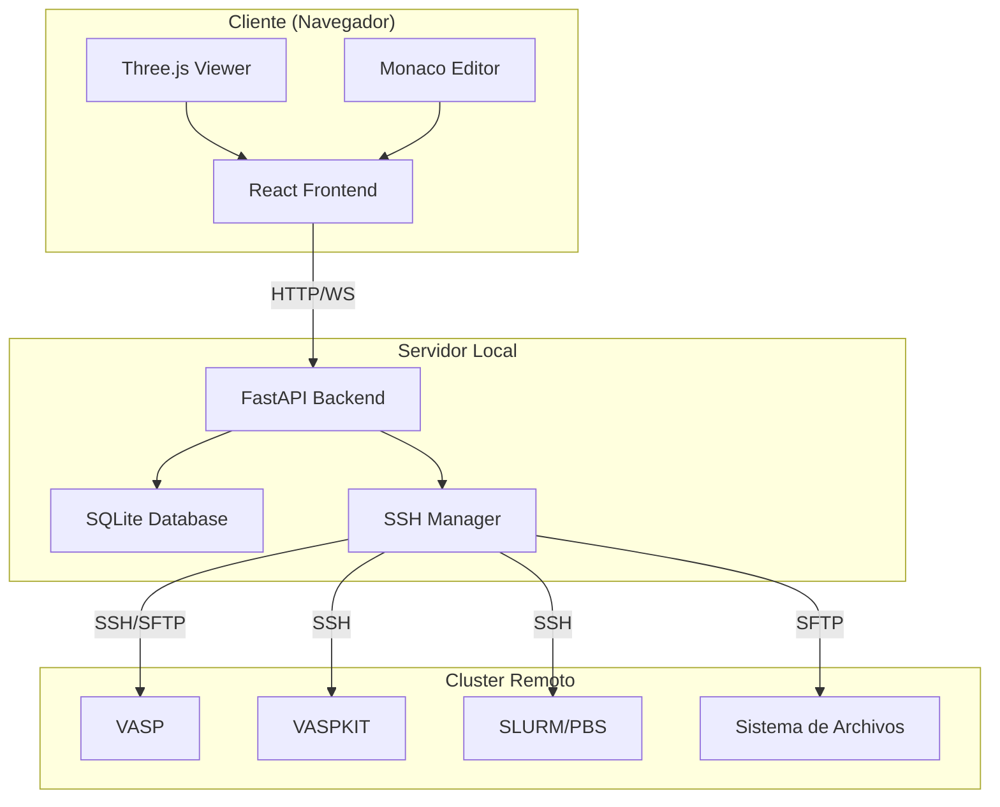

# Arquitectura Detallada - VASP GUI

## 🏛️ Visión General de la Arquitectura

### Componentes Principales



## 🔄 Flujo de Datos Completo

### 1. Creación de Proyecto

```
Usuario              Frontend           Backend            Database
  |                     |                  |                  |
  |--[Crear Proyecto]-->|                  |                  |
  |                     |--[POST /api/projects]-------------->|
  |                     |                  |--[INSERT]------->|
  |                     |                  |<--[project_id]---|
  |                     |<-[200 OK: {...}]-|                  |
  |<-[Mostrar Proyecto]-|                  |                  |
```

### 2. Generación de Archivos con VASPKIT

```
Usuario    Frontend    Backend         SSH Manager    Cluster
  |           |           |                 |            |
  |--[Gen]-->|           |                 |            |
  |           |--[POST /dos/generate]----->|            |
  |           |           |--[connect]----->|            |
  |           |           |                 |--[SSH]---->|
  |           |           |--[mkdir]------->|            |
  |           |           |                 |--[mkdir]-->|
  |           |           |--[upload POSCAR]------------>|
  |           |           |--[exec VASPKIT]------------->|
  |           |           |                 |<-[INCAR]---|
  |           |           |<--[archivos generados]-------|
  |           |<-[200: archivos actualizados]------------|
  |<-[Mostrar archivos editables]------------------------|
```

### 3. Ejecución de Trabajo

```
Usuario    Frontend    Backend    SSH Manager    Cluster    Queue System
  |           |           |            |            |            |
  |--[Run]-->|           |            |            |            |
  |           |--[POST /dos/submit]-->|            |            |
  |           |           |--[validate files]----->|            |
  |           |           |--[create job.sh]------>|            |
  |           |           |--[sbatch job.sh]------>|            |
  |           |           |            |            |--[submit]->|
  |           |           |            |<-----------[job_id]----|
  |           |<-[200: job_id, status=running]------------------|
  |<-[Monitor View]-------------------------------------------- |
```

### 4. Monitoreo en Tiempo Real (WebSocket)

```
Frontend         Backend        SSH Manager      Cluster
  |                 |                |              |
  |--[WS Connect]-->|                |              |
  |<--[Connected]---|                |              |
  |                 |--[Timer: cada 30s]           |
  |                 |--[squeue -j ID]------------->|
  |                 |<--[job status]---------------|
  |<--[WS: update]--|                |              |
  |                 |--[tail OUTCAR]-------------->|
  |                 |<--[progress info]------------|
  |<--[WS: logs]----|                |              |
```

## 🗂️ Modelo de Datos

### Diagrama ER

```
┌─────────────────────────────────────┐
│           Project                    │
├─────────────────────────────────────┤
│ id (PK)                              │
│ name                                 │
│ description                          │
│ calculation_type (ENUM)              │
│ status (ENUM)                        │
│ poscar (TEXT)                        │
│ incar (TEXT)                         │
│ kpoints (TEXT)                       │
│ potcar_info (JSON)                   │
│ remote_path (STRING)                 │
│ job_id (STRING)                      │
│ created_at (DATETIME)                │
│ updated_at (DATETIME)                │
│ started_at (DATETIME)                │
│ completed_at (DATETIME)              │
│ results (JSON)                       │
│ error_log (TEXT)                     │
└─────────────────────────────────────┘
```

### Estados del Proyecto

```
DRAFT ──> READY ──> RUNNING ──> COMPLETED
                        │
                        └───> FAILED
                        │
                        └───> CANCELLED
```

## 🔌 API Endpoints Detallados

### Projects CRUD

| Método | Endpoint | Descripción | Request Body | Response |
|--------|----------|-------------|--------------|----------|
| POST | `/api/projects/` | Crear proyecto | `ProjectCreate` | `ProjectResponse` |
| GET | `/api/projects/` | Listar proyectos | Query params: skip, limit | `List[ProjectResponse]` |
| GET | `/api/projects/{id}` | Ver proyecto | - | `ProjectResponse` |
| PATCH | `/api/projects/{id}` | Actualizar | `ProjectUpdate` | `ProjectResponse` |
| DELETE | `/api/projects/{id}` | Eliminar | - | `204 No Content` |

### DOS Workflow

| Método | Endpoint | Descripción | Request Body | Response |
|--------|----------|-------------|--------------|----------|
| POST | `/api/dos/generate` | Generar archivos VASP | `DOSGenerateRequest` | `ProjectResponse` |
| POST | `/api/dos/submit` | Enviar a cluster | `JobSubmitRequest` | `JobStatusResponse` |
| GET | `/api/dos/status/{id}` | Ver estado | - | `JobStatusResponse` |
| GET | `/api/dos/results/{id}` | Obtener resultados | - | JSON con DOSCAR |

## 🔐 Seguridad

### Conexión SSH

```python
# Método preferido: SSH Key
CLUSTER_SSH_KEY_PATH=/path/to/private/key

# Alternativa: Password (menos seguro)
CLUSTER_PASSWORD=your-password
```

### Mejores Prácticas

1. **Usar SSH Keys en lugar de passwords**
2. **No commitear el archivo `.env`** (incluido en `.gitignore`)
3. **Cambiar `SECRET_KEY` en producción**
4. **Limitar CORS_ORIGINS a dominios específicos**
5. **Implementar rate limiting para producción**
6. **Usar HTTPS en producción**

## 📦 Dependencias Críticas

### Backend Core

```
fastapi + uvicorn  →  Servidor web asíncrono
paramiko          →  Cliente SSH/SFTP
sqlalchemy        →  ORM para base de datos
pydantic          →  Validación de datos
```

### VASP Integration

```
pymatgen          →  Parsing archivos VASP
ase               →  Manipulación estructuras
```

### Communication

```
websockets        →  Tiempo real
python-socketio   →  WebSocket alternative
```

## 🎨 Frontend (Propuesta)

### Stack Tecnológico

```javascript
// package.json
{
  "dependencies": {
    "react": "^18.x",
    "react-router-dom": "^6.x",
    "@mui/material": "^5.x",
    "axios": "^1.x",
    "socket.io-client": "^4.x",
    "@tanstack/react-query": "^5.x",
    "three": "^0.160.x",
    "@react-three/fiber": "^8.x",
    "recharts": "^2.x",
    "monaco-editor": "^0.45.x"
  }
}
```

### Estructura de Componentes

```
src/
├── components/
│   ├── StructureViewer/
│   │   ├── ThreeViewer.tsx      # Visualización 3D
│   │   └── StructureInfo.tsx    # Info estructura
│   ├── FileEditor/
│   │   ├── POSCAREditor.tsx     # Editor POSCAR
│   │   ├── INCAREditor.tsx      # Editor INCAR
│   │   └── KPOINTSEditor.tsx    # Editor KPOINTS
│   ├── JobMonitor/
│   │   ├── JobList.tsx          # Lista trabajos
│   │   ├── JobStatus.tsx        # Estado individual
│   │   └── LogViewer.tsx        # Ver logs
│   └── ResultsViewer/
│       ├── DOSPlot.tsx          # Gráfica DOS
│       └── EnergyChart.tsx      # Convergencia
├── pages/
│   ├── Dashboard.tsx            # Vista principal
│   ├── NewProject.tsx           # Crear proyecto
│   ├── ProjectDetail.tsx        # Detalle proyecto
│   └── Results.tsx              # Resultados
├── services/
│   ├── api.ts                   # Cliente HTTP
│   └── websocket.ts             # Cliente WS
└── hooks/
    ├── useProject.ts            # Hook proyectos
    └── useJobMonitor.ts         # Hook monitoreo
```

## 🚀 Deployment

### Desarrollo Local

```bash
# Backend
cd backend
python -m app.main

# Frontend (futuro)
cd frontend
npm run dev
```

### Producción (Propuesta)

```
┌────────────────────┐
│   Nginx Reverse    │
│      Proxy         │
└─────┬──────────────┘
      │
      ├──> /api  ──> FastAPI (Uvicorn)
      │
      └──> /     ──> React (Build estático)
```

### Docker Compose (Futuro)

```yaml
version: '3.8'
services:
  backend:
    build: ./backend
    ports:
      - "8000:8000"
    environment:
      - CLUSTER_HOST=${CLUSTER_HOST}
    volumes:
      - ./backend:/app
  
  frontend:
    build: ./frontend
    ports:
      - "3000:3000"
    depends_on:
      - backend
```

## 📊 Monitoreo y Logging

### Niveles de Log

```python
DEBUG   →  Comandos SSH detallados
INFO    →  Operaciones normales
WARNING →  Problemas no críticos
ERROR   →  Errores que requieren atención
```

### Métricas a Monitorear

- Tiempo de respuesta API
- Trabajos activos en cluster
- Errores de conexión SSH
- Uso de disco (archivos generados)

## 🔄 Ciclo de Vida de un Proyecto DOS

```
1. DRAFT
   ↓ (Usuario crea proyecto con POSCAR)
   
2. READY
   ↓ (Backend genera archivos con VASPKIT)
   ↓ (Usuario revisa/edita parámetros)
   
3. RUNNING
   ↓ (Backend envía a cluster)
   ↓ (Monitoreo cada 30s)
   
4. COMPLETED / FAILED
   ↓ (Backend descarga resultados)
   ↓ (Usuario visualiza DOS)
```

## 🛠️ Troubleshooting Architecture

### SSH Connection Issues

```python
# Test manual
from app.core.ssh_manager import SSHManager
ssh = SSHManager()
ssh.connect()
ssh.execute_command("ls -la")
ssh.disconnect()
```

### Database Issues

```bash
# Recrear base de datos
rm vasp_gui.db
python -c "from app.models.database import init_db; import asyncio; asyncio.run(init_db())"
```

### VASPKIT Issues

```bash
# Test en cluster
ssh user@cluster
cd /path/to/work/dir
echo -e '102\n5\n' | /path/to/vaspkit
```

## 📈 Escalabilidad Futura

### Múltiples Usuarios

- Agregar tabla `Users`
- Implementar autenticación JWT
- Relación `User ←→ Projects`

### Múltiples Clusters

- Tabla `Clusters` con credenciales
- Selector de cluster por proyecto
- Pool de conexiones SSH

### Queue de Trabajos

- Implementar Celery + Redis
- Cola de prioridad
- Reintentos automáticos

---

**Esta arquitectura está diseñada para ser modular, escalable y fácil de mantener.**
